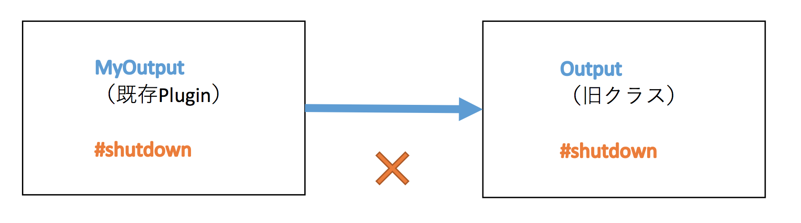
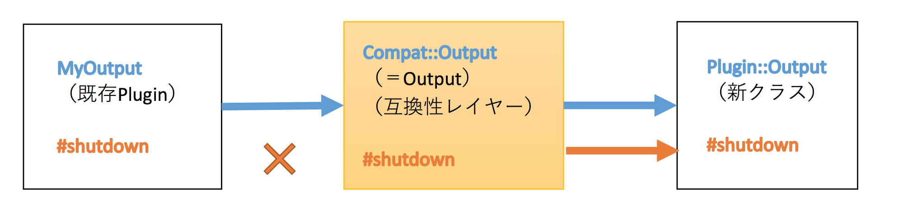
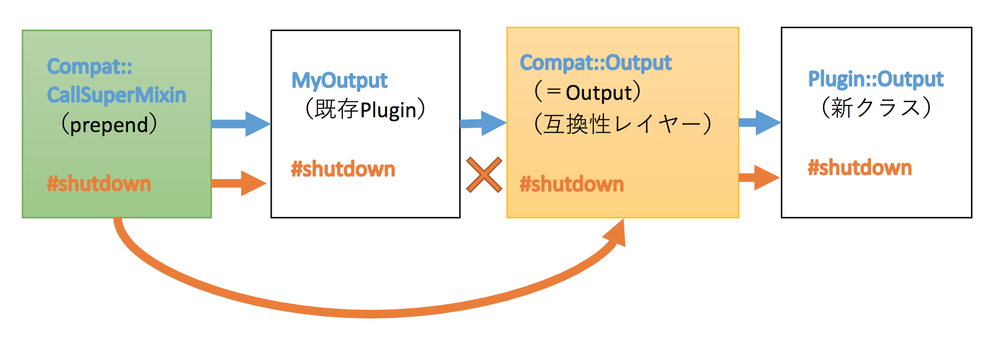
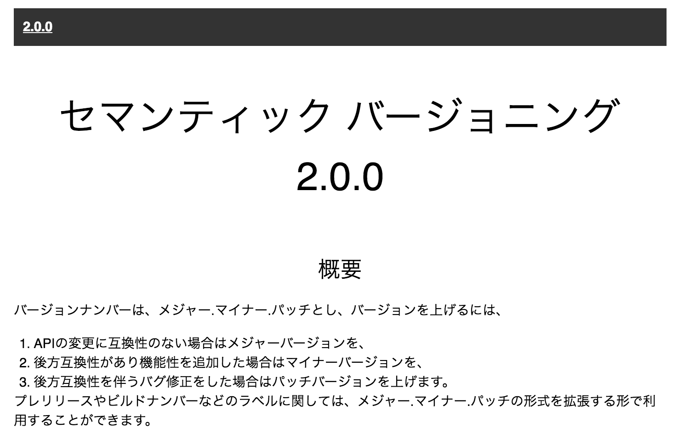
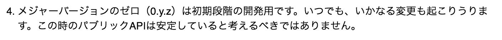
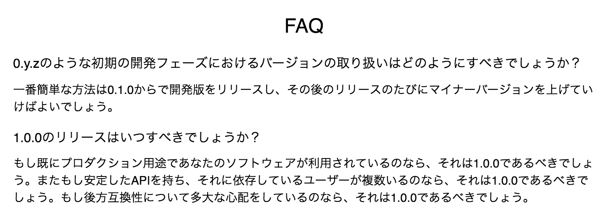

% fluentdの互換性を維持したライブラリ内部実装の変更
% yamotonalds
% 2016-09-21

# はじめに

## 

この発表は

RubyKaigi 2016 2日目

[「Modern Black Mages Fighting in the Real World」](http://www.slideshare.net/tagomoris/modern-black-mages-fighting-in-the-real-world)

Satoshi "moris" Tagomori
（fluentdの中の人）

の一部を簡略化して紹介

## Tagomoriさんのセッション

- fluentd v0.12 → v0.14 の変更
- Pluginの互換性を維持するためのテクニック
    - 無くなったメソッドの代わりを用意
    - Signatureの一致しないメソッドへの対処
    - superを呼ばないクラスをsuperを呼ぶようにする

## 

数百のPluginが存在するため、

**既存Pluginのコードを変更せずに** 

Updateできるようにする

Ruby（動的言語）らしい方法（メタプログラミング）で互換性を維持

# superを呼ばないクラスをsuperを呼ぶようにする

## v0.12

MyOutputはsuperを呼んでない

v0.14では呼ぶようにしたい

## v0.14

`Output = Compat::Output` で既存Pluginは自動的に互換性レイヤーを使用

. . . 

これだけ見るとMyOutputはsuperを呼んでない

## superを呼ぶmoduleをprepend

`CallSuperMinin` が `MyOutput#shutdown` と `Plugin::Output#shutdown` を呼び出す

# コード

#

## 感想

- Rubyらしい :ruby:
- 世間への影響を考慮して互換性維持 👍
- しかも吸収のための層に閉じ込めてあって移行完了したら取り除ける 👍
    - 互換性レイヤー保守するの大変そうだから早く移行してあげてほしい
- そこまでするならv1.0にしても良いのでは ❓

## 

## 

## 

## v1.0にしても良いのでは ❓

